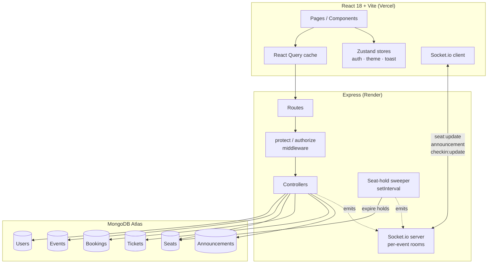

# EventHub

Tech Conference & Event Management Platform — MERN stack. Built as Task 5 for the
Code A Nova Full Stack Development internship.

## Status: All 10 Days Complete ✅

- [x] Vite + React + Tailwind frontend scaffolded
- [x] Express backend scaffolded
- [x] MongoDB Atlas connection wired up
- [x] Health-check route (`GET /api/health`) proving frontend ↔ backend ↔ DB
- [x] Auth system (Day 2)
- [x] Event management (Day 3)
- [x] Seat selection + real-time availability (Day 4)
- [x] Ticket booking + QR generation (Day 5)
- [x] Organizer dashboard (Day 6)
- [x] QR check-in (Day 7)
- [x] Attendee portal (Day 8)
- [x] Testing + responsive audit (Day 9)
- [x] Deployment + demo (Day 10)

## Tech Stack

| Layer | Tech |
|---|---|
| Frontend | React 18, Vite, Tailwind CSS, Zustand, React Query |
| Backend | Node.js, Express |
| Database | MongoDB (Atlas) + Mongoose |
| Auth | JWT + bcrypt, role claims |
| Real-time | Socket.io |
| QR | `qrcode` npm package |
| Testing | Jest + Supertest |
| Deployment | Vercel (frontend) + Render (backend) |

## Project Structure

```
eventhub/
├── client/          # React + Vite frontend
│   └── src/
│       ├── api/     # axios instance
│       ├── App.jsx
│       └── main.jsx
├── server/          # Express backend
│   └── src/
│       ├── config/       # db connection
│       ├── controllers/
│       ├── middleware/
│       ├── models/
│       ├── routes/
│       ├── __tests__/
│       ├── app.js        # express app (testable, no listen())
│       └── index.js      # server bootstrap + socket.io
├── package.json     # root convenience scripts
└── README.md
```

## Local Setup

### Prerequisites
- Node.js 18+
- A free [MongoDB Atlas](https://www.mongodb.com/atlas) cluster

### 1. Clone and install
```bash
git clone <your-repo-url>
cd eventhub
npm run install:all
```

### 2. Configure environment variables
```bash
cp server/.env.example server/.env
cp client/.env.example client/.env
```
Fill in `server/.env` with your MongoDB Atlas connection string and JWT secrets.

### 3. Run both apps together
```bash
npm run dev
```
- Frontend: http://localhost:5173
- Backend: http://localhost:5000/api/health

## Auth System (Day 2)

- **Registration**: `POST /api/auth/register` — role is selected client-side (attendee/organizer) but the server ignores anything outside that enum and defaults to `attendee`, so a client can never grant itself elevated access.
- **Login**: `POST /api/auth/login` — verifies against a bcrypt hash (10 salt rounds), never stores or logs plaintext.
- **Session**: JWT is set as an `httpOnly` cookie (not readable by JS, mitigates XSS token theft) and also returned in the response body for non-browser API clients.
- **`protect` middleware**: verifies the JWT server-side on every protected route and re-fetches the user from the DB (so a deleted user's old token stops working immediately).
- **`authorize(...roles)` middleware**: role guard used after `protect` — e.g. `router.post("/events", protect, authorize("organizer"), createEvent)`. This is the exact pattern Day 3's organizer-only event routes will use.
- **Client**: Zustand `authStore` calls `/api/auth/me` on load to restore session state (since the cookie itself isn't readable), plus `ProtectedRoute` for route-level guarding and role-based nav in `Navbar`.

## Event System (Day 3)

- **Model**: `name`, `description`, `category` (enum, powers the filter dropdown), `date` (must be in the future), `venue`, `capacity`, `priceTiers` (array of `{name, price, quantity}` — at least one required), `organizer` (ref), `status` (draft/published/cancelled), `ticketsSold` (kept in sync by the booking flow from Day 4/5 onward), plus a `seatsRemaining` virtual.
- **Ownership enforcement**: `updateEvent`/`deleteEvent` load the event, then check `event.organizer === req.user._id` in the controller — not just role, so one organizer can't edit another organizer's event. This is checked via a shared `assertIsOwner` helper so update/delete can't drift out of sync.
- **Public listing**: `GET /api/events?search=&category=&from=&to=&page=&limit=` — text search on name/venue, category filter, date-range filter, pagination. Only `status: "published"` events are ever returned publicly.
- **Organizer's own list**: `GET /api/events/mine/list` returns all of the organizer's events regardless of status — this is what the dashboard table reads from.
- **Client**: `EventForm` is a single reusable component for both create and edit (dynamic price-tier rows), `Events.jsx` is the public filterable listing, `OrganizerDashboard` now lists/edits/deletes owned events via a table.

## Seat Map & Real-Time Availability (Day 4)

- **One Seat document per physical seat**, generated automatically when an event is created — one seat per unit of price-tier `quantity`. A pre-validate hook on `Event` requires tier quantities to sum to `capacity`, so this mapping is always deterministic.
- **Atomic holds, no transaction needed here**: `holdSeat` uses `findOneAndUpdate({ status: "available" }, { status: "held", ... })` — a single-document write, which MongoDB already guarantees is atomic. Two attendees racing for the same seat: exactly one gets `200`, the other gets `409`. (Day 5's actual booking commit spans seat + ticket + event counters together — that's where a real multi-document transaction becomes necessary, not here.)
- **2-minute auto-expiry**: a `setInterval` sweep (`seatHoldSweeper.js`) runs every 15s, finds seats whose `holdExpiresAt` has passed, flips them back to `available`, and emits a Socket.io update to that event's room. The core logic is exported as `expireStaleHolds()` so it's directly unit-testable (back-date a hold, call the function, assert) instead of needing to wait on a real timer.
- **Socket.io rooms are scoped per event** (`event:<id>`) — a client only joins the room for whichever event's seat map is open, and the server never broadcasts globally. This satisfies the brief's explicit constraint against global seat broadcasts.
- **Editing capacity/price tiers after seats exist**: blocked once any seat is held or booked (`400`); if none are locked in yet, the update is allowed and the whole seat map is safely regenerated to match the new tiers.
- **Client**: `SeatMap.jsx` fetches the initial seat list via React Query, then joins the event's Socket.io room and merges live `seat:update` events into local state — so a seat someone else holds visibly locks (amber) and later frees (grey) without a page refresh. A held-by-you seat shows a live per-second countdown.

## Booking Flow (Day 5)

- **The one genuine multi-document transaction in the app.** `POST /api/bookings` touches four things together: flips each seat from `held` → `booked`, creates the `Booking`, creates one `Ticket` per seat, and increments `Event.ticketsSold`. All of it is wrapped in `session.withTransaction(...)` — if any seat's hold has expired or was grabbed by someone else mid-checkout, the whole thing rolls back atomically. No partial bookings, no oversold seats.
- **Why this one needed a transaction and Day 4's hold didn't**: a hold is a single-document conditional update (atomic by default in MongoDB). A booking spans 4 collections — that's exactly the case transactions exist for.
- **QR codes encode a signed JWT, not a plain ticket ID** — signed with a dedicated `QR_SECRET` (separate from the auth `JWT_SECRET`), including a random `jti` so it can't be replayed or forged even if someone tampered with a screenshot of a QR code. This satisfies the brief's explicit constraint. Day 7's check-in will verify this same token.
- **Mock payment**: a card form on the client that never talks to a real gateway — "payment" is really just the booking transaction committing successfully. This is a deliberate simplification, worth stating plainly if asked ("no PCI-scope, no real gateway — the brief calls for a mock payment step, not a Stripe integration").
- **Testing transactions required a different test setup**: `mongodb-memory-server`'s standalone mode (used by every other test file) doesn't support transactions — only a replica set does. `bookings.test.js` spins up a single-node `MongoMemoryReplSet` instead, which is enough to exercise real transaction semantics without a multi-node cluster.

## Pre-Day-6 Polish Pass

A UI/UX + price-tier correctness pass on top of Days 1-5, before starting Day 6.

- **Dark/light theme**: `darkMode: "class"` in Tailwind, a `themeStore.js` (zustand, same pattern as auth/theme-agnostic) that persists to `localStorage` and defaults to system preference, plus a tiny inline script in `index.html` that applies the saved class before React mounts (no flash of the wrong theme). Toggle lives in the Navbar on every route.
- **Shared UI kit** (`components/ui/`): `Button`, `Card`, `Alert`, `Badge`, `Spinner`, `EmptyState`, and shared `inputClasses`/`labelClasses`. Every page now composes from these instead of one-off Tailwind strings, so the visual language (spacing, borders, focus rings, disabled states) is consistent and only needs to change in one place.
- **Price-tier visibility (the actual gap behind the reported bug)**: `GET /api/events/:id/seats` now also returns `meta.tierSummary` — per-tier price/quantity/available/held/booked, computed server-side from real Seat documents. `PriceTierList.jsx` renders this as tier cards with live availability and a "Sold Out" state; `SeatMap.jsx` accepts a `tierFilter` to visually dim seats outside the selected tier. Mixed-tier bookings are supported and stated explicitly in the UI.
- **Card expiry**: replaced the free-text field with `CardExpiryInput.jsx` — month/year `<select>` pair, validated against the current month (`isExpiryValid`). This is the mock-payment card's expiry only; event date/time is untouched.
- **What was NOT a bug**: checkout's per-seat pricing (`priceFor(seat.tierName)`) and the backend's booking-amount calculation already resolved each seat's own tier correctly — neither ever used `priceTiers[0]` or trusted a client-sent price. Verified by reading the code and by a dedicated regression test (`bookings.test.js`) that books a VIP + General seat together and asserts each ticket's price independently.

## Organizer Dashboard (Day 6)

- **Analytics**: `GET /api/events/:id/dashboard/analytics` computes total revenue, tickets sold, sold %, and a per-tier revenue breakdown by aggregating the actual `Ticket` collection (`$group` by `tierName`) - not read off the event's cached `ticketsSold` counter. Rendered as stat cards plus a lightweight bar chart (`RevenueChart.jsx`, plain proportional divs - no charting library added for a handful of bars).
- **Attendee roster**: `GET /api/events/:id/dashboard/attendees` returns each ticket joined with the attendee's name/email and seat label. The same endpoint doubles as CSV export via `?format=csv` (one code path, not two) - the client requests it with `responseType: "blob"` through the authenticated axios instance and triggers a real file download, rather than a plain link (which would be more fragile across cookie/CORS setups).
- **Announcements**: organizer sends via `POST /api/events/:id/announcements` (owner-checked), persisted to an `Announcement` collection so any ticket-holder can read it later, *and* pushed live over the same per-event Socket.io room the seat map already uses. There's no real email/SMS gateway in this project's scope, so this is the honest mock-equivalent of "sent" - stated plainly rather than implied to be a real notification.
- **Authorization**: both new controllers reuse the same `assertIsOwner` helper from `eventController.js` (now exported) rather than re-implementing ownership checks - an organizer can only see analytics/roster/announcements for events they own; attendees are blocked from all three except reading announcements for events they hold a ticket to.

## Design System Pass (frontend only, Days 1-6 untouched)

A visual/UX pass to move the app from "functional CRUD prototype" toward a cohesive, premium-feeling SaaS product - zero backend changes, zero new npm dependencies.

- **Design tokens**: `tailwind.config.js` gained a `brand` (indigo/violet) shade scale, `boxShadow.glow`/`elevated`, a `grid-pattern` background image, and a small motion system (`fade-in-up`, `scale-in`, `pop`, `check-draw`, `shimmer` keyframes). `index.css` gained a semantic utility layer (`surface-card`, `surface-glass`, `text-heading`, `gradient-text`, `section-heading`, `input-base`, etc.) so pages compose from shared tokens instead of scattering `bg-slate-X dark:bg-slate-Y` pairs independently. `prefers-reduced-motion: reduce` is respected globally.
- **UI kit additions**: `Skeleton`/`SkeletonCard`, `StatCard`, `SectionHeader`, `PageContainer`, plus a lightweight `toastStore` (zustand, same pattern as auth/theme) + `ToastContainer` - no toast library added.
- **Semantic color coding is consistent app-wide**: available/success = emerald, limited/warning = amber, sold out/danger = rose, info = sky, primary/brand = indigo-violet. Seat map, price tier cards, event cards, and badges all use the same mapping.
- **Motion is deliberate, not decorative**: hero/card entrance (`fade-in-up`), modal-like scale-in on auth cards, a pulse on the checkout countdown once it turns critical, an animated SVG checkmark on the confirmation page, a shimmer skeleton for loading states - all CSS/Tailwind, no animation library.
- **Real data only**: every stat card (attendee dashboard's ticket/spend totals, organizer dashboard's aggregate KPIs) is computed client-side from fields the existing APIs already return - nothing invented.

## QR Check-In (Day 7)

- **Check-in validates the same signed token from Day 5** — `POST /api/events/:id/checkin` calls `verifyTicketToken` on whatever string comes in (scanned or manually pasted), so a forged or tampered code fails signature verification before any database lookup happens.
- **Three checks beyond signature validity**: the token's embedded `eventId` must match the event being checked into (a ticket for Event A can't be used to check into Event B), the ticket must actually belong to that event in the database (defense in depth beyond the token payload), and it must not already be `checked-in` or `cancelled`.
- **Real-time count**: on every successful check-in, `checkedInCount`/`totalTickets` are recomputed from the `Ticket` collection and broadcast via `checkin:update` to the event's Socket.io room — same per-event room pattern as seat availability and announcements.
- **Camera scanning uses the browser's native `BarcodeDetector` API** — no QR-decoding library added. Where it's unsupported (notably Safari/Firefox at time of writing), the UI says so plainly and manual token entry always works as the alternative, going through the identical verification path.

## Attendee Portal (Day 8)

- **Event discovery, upcoming vs past**: event search/category/date filtering already existed from Day 3 (`Events.jsx`); the Attendee Dashboard now adds Upcoming/Past tabs, both derived purely from comparing each booking's `event.date` to the current time client-side — no new backend field needed.
- **Cancellation is a genuine reversal transaction**, not a soft flag: `POST /api/bookings/:id/cancel` touches the same four things Day 5's booking created — Seat (back to `available`), Ticket(s) (`cancelled`), Booking (`cancelled` + `paymentStatus: "refunded"`), and `Event.ticketsSold` (decremented) — all inside one `session.withTransaction()`, for the same reason the original booking needed one: partial success here would either strand a seat as permanently unavailable or silently oversell it back to someone else.
- **Guards**: can't cancel a booking that's already cancelled, can't cancel after the event has already happened, and can't cancel if any of its tickets have already been checked in (Day 7) — cancelling a walked-in attendee's ticket after the fact doesn't make sense.
- **"Refund simulated"** is stated plainly in the UI — `paymentStatus: "refunded"` is a mock flag, consistent with Day 5's mock payment; there's no real payment gateway to reverse.
- **Freed seats update in real time** — the same `seat:update` Socket.io event Day 4's holds use is emitted on cancellation too, so anyone viewing that event's seat map sees the seat become available again immediately.

## Testing & Responsive Audit (Day 9)

- **77 backend tests** across 7 files (auth, events, seats, bookings + cancellation, dashboard + announcements, checkin, health). Rather than pad this pass with redundant tests, I audited existing coverage and closed 4 genuine gaps: two cancellation guards that existed in code but were never tested (blocking cancellation of an already-checked-in ticket, and of a past event), a check-in edge case (a validly-signed token whose ticket was never actually created), and password-length validation on registration.
- **Day 7's "Invalid or expired QR code" bug** (reported mid-session) is fixed: the real issue was that the Confirmation page never displayed the plaintext QR token anywhere — only the rendered image — so there was no legitimate way to obtain a token for manual check-in entry. Confirmation now has a "Show QR token" reveal + copy button. Separately, `checkinController.js` now distinguishes a genuinely expired token from a merely malformed one instead of collapsing every verification failure into one message — both are covered by regression tests.
- **Responsive audit was code-level** (no browser available in this environment): grepped for hardcoded widths, unconstrained multi-column grids, and un-wrapped tables. Both dashboard tables were already correctly wrapped in `overflow-x-auto` containers (safe). Found and fixed one real issue: `EventForm`'s price-tier row used a fixed 8-column grid with no mobile breakpoint, making each field a cramped ~40px on a phone — it now stacks to a readable 2-column layout below the `sm:` breakpoint.

## Data Model

### User
`name`, `email` (unique), `password` (bcrypt hash, `select: false`), `role` (attendee/organizer).

### Event
See above. Indexed on `{name, venue}` (text) for search, and `{category, date}` for filtered listing.

### Seat
`event` (ref), `tierName`, `row`, `col`, `label` (e.g. `R1S3`), `status` (available/held/booked), `heldBy` (ref, nullable), `holdExpiresAt` (nullable). Unique on `{event, label}`; indexed on `{status, holdExpiresAt}` for the expiry sweep.

### Booking
`user` (ref), `event` (ref), `seats` (array of Seat refs), `totalAmount`, `paymentStatus` (mock, always "paid"), `status` (confirmed/cancelled).

### Ticket
`booking`, `event`, `seat`, `user` (all refs), `tierName`, `price`, `qrToken` (signed JWT, unique), `qrCodeDataUrl` (base64 PNG), `status` (valid/checked-in/cancelled), `checkedInAt` (set on Day 7).

### Announcement
`event`, `organizer` (refs), `subject`, `message`, timestamps.

## Architecture Diagram



**Request flow for a booking**: Client holds a seat (`POST /seats/:id/hold`) → atomic single-document update → Socket.io broadcasts to the event's room → Client submits checkout (`POST /bookings`) → one MongoDB transaction updates Seat + creates Booking + creates Ticket(s) + increments `Event.ticketsSold` → signed QR token generated per ticket → Confirmation page renders it.

## Deployment (Render + Vercel)

Both cookie settings (`secure`/`sameSite` toggled by `NODE_ENV`) and CORS origins (`CLIENT_URL` env var) were already built environment-aware back in Day 2 — no code changes were needed for cross-origin production hosting, only environment variables.

**One requirement worth knowing**: the booking and cancellation flows use real MongoDB transactions (Day 5/8), which require a replica set. MongoDB Atlas — including the free M0 tier — is always provisioned as a replica set, so this is satisfied automatically if you're using Atlas. A self-hosted standalone `mongod` would **not** support these flows.

### 1. Backend on Render
1. Push this repo to GitHub if you haven't already.
2. On [render.com](https://render.com), **New → Web Service**, connect the repo.
3. **Root Directory**: `server`
4. **Build Command**: `npm install`
5. **Start Command**: `npm start`
6. Add environment variables (same names as `server/.env.example`): `MONGO_URI` (your Atlas connection string), `JWT_SECRET`, `JWT_EXPIRES_IN`, `QR_SECRET`, `CLIENT_URL` (your Vercel URL — add this *after* step 2 below, since you'll need that URL first), `NODE_ENV=production`.
7. Deploy. Note the resulting URL (e.g. `https://eventhub-api.onrender.com`).

### 2. Frontend on Vercel
1. On [vercel.com](https://vercel.com), **New Project**, import the repo.
2. **Root Directory**: `client`
3. Build command and output directory are auto-detected (Vite).
4. Add environment variables: `VITE_API_URL=https://<your-render-url>/api`, `VITE_SOCKET_URL=https://<your-render-url>`.
5. Deploy. `vercel.json` in this repo already handles the SPA rewrite (`/*` → `/index.html`) so client-side routes like `/events/:id` don't 404 on refresh.
6. Go back to Render and set `CLIENT_URL` to this Vercel URL, then redeploy the backend so CORS/cookies/Socket.io accept requests from it.

### 3. Verify
Visit the Vercel URL, register an account, and confirm the health check succeeds (Network tab: `GET /api/health` → 200). Then run through the demo script below.

## Seeding Demo Data

```bash
cd server
npm run seed
```

This wipes and repopulates the database with 2 organizers, 3 attendees, 4 events across different categories (with realistic price tiers and availability), and one pre-made booking so the organizer dashboard shows non-zero analytics immediately. All demo accounts use the password `demo1234`. Refuses to run against `NODE_ENV=production` unless you pass `--force` — a safeguard against accidentally wiping a real deployment's data.

## 5-Minute Demo Script

I can't record video from this environment, but here's a script that hits every rubric-relevant feature in order:

1. **(0:00-0:30) Register both roles** — sign up as an organizer, then (incognito window) as an attendee.
2. **(0:30-1:15) Organizer: create an event** — two price tiers, watch the live capacity/tier-quantity validation in the form.
3. **(1:15-2:30) Attendee: discover, filter, select seats** — search/filter on `/events`, open the event, show the price-tier cards with live availability, select seats from two different tiers on the seat map (demonstrates real-time Socket.io — hold a seat in one window, show it lock in the other).
4. **(2:30-3:15) Checkout → Confirmation** — show the countdown timer, mock payment form, then the confirmation page with the signed QR ticket.
5. **(3:15-4:00) Organizer dashboard** — revenue chart, attendee roster, export CSV, send an announcement (show it arrive live on the attendee's still-open Event Details page).
6. **(4:00-4:45) Check-in** — Check-In Scanner page, manual token entry (copy from Confirmation's "Show QR token"), live attendee count updating.
7. **(4:45-5:00) Attendee dashboard + cancellation** — Upcoming/Past tabs, cancel a booking, show the seat freed on the seat map in real time.
